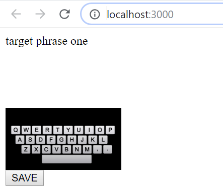

This project is a starter code for the assignment 2 of the CSC428/CSC2514, Fall 2019, at the University of Toronto.

We have provided comments in the code for you to better understand it. Here we provide instructions about how to run the code in addition to the general guidelines about the react app, on which this starter code is built.

Read the first two sections in the table of contents to understand how to run the code on laptops/desktops/mobiles. The rest sections provide general guidelines about the react app.

## Table of Contents
- [Folder Structure](#folder-structure)
- [How to run the project](#run-project)
- [Further Questions](#further-questions)

## Folder Structure
The project structure is as follows:

```
csc428A2Starter/
  README.md
  node_modules/
  package.json
  public/
    index.html
    images/
    favicon.ico
  src/
    App.css
    App.js
    index.css
    index.js
    keyboard.normal.js
    keyboard.wip.js
    keys.js
    textarea.js
    watch.js
    logo.svg
    asset/
```

## Run Project

First, make sure you have npm installed on your test machine (e.g., a laptop or a desktop).
If you haven't installed it on your test machine, follow instructions here: https://www.npmjs.com/get-npm

Second, after you have installed npm successfully, go the project folder, and type the following command:

### `npm install`

This will install all the dependency libraries.

Third, in the project directory, type the following command:
### `npm start`

This command will start the application in a browser tab and display the app in the tab. Imagelink: 
.

We have tested the code with the Chrome(> version 55) and Safari on different touch-screen platforms (e.g., laptops, android phones, iOS devices).

Fourth, in this experiment, you will examine the text entry performance of two types of keypbards on "smartwatch."

The smartwatch can be simulated on any touch-screen enabled devices (e.g., laptops, android phones, iOS devices).
If you wish to use your touch-screen laptop to simulate the smartwatch,
you need to think about how to position your laptop so that it simulates a smartwatch use scenario as closely as possible.

If you decide to use a smartphone to carry out the experiment, then you need to think about use something (e.g., a cloth strip) to hold the phone to the user's wrist. You must then follow the instructions below:

- 1) Check the IP address of your laptop (or desktop)   
- 2) Ensure that your smartphone and your laptop (or desktop) are in the same network (e.g., same WiFi)
- 3) Install and update your Chrome browser to the latest version
- 4) Open the browser and type the following in the browser: IP:3000

You should now see the same keyboard interface as you see in Step 3 on your laptop (or desktop).

You can write code to render a Watch Image around the keyboard to make it more realistic.

Lastly, we have written comments in the code to help understand it.

## Further Questions

Spend time reading, playing around with the code carefully to understand it first.
If you have further questions, you can contact TAs at:
Bryan Wang: bwang@dgp.toronto.edu,
Fengyuan Zhu: fyzhu@dgp.toronto.edu

For some common strategies gathering from previous years, please refer to the github link below: https://github.com/zhufyaxel/CSC428_Assignment2_Extra_Help_Documentation

For more information about React App, please visit this website: https://github.com/facebook/create-react-app/blob/master/packages/react-scripts/template/README.md
